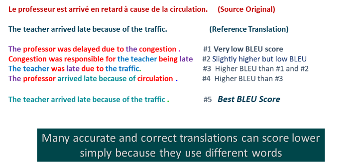
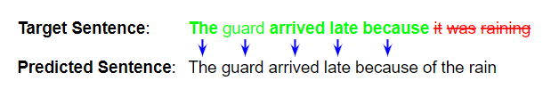
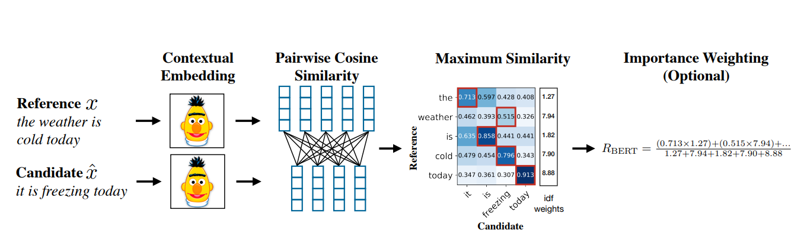

In this paper, we will explore the BERTScore text evaluation metric from the paper _BERTScore - Evaluating Text Generation with BERT_

Paper：<https://arxiv.org/pdf/1904.09675.pdf>

Github: <https://github.com/Tiiiger/bert_score>

## Introduction

In the ever-evolving realm of machine learning, particularly within Natural Language Processing (NLP) and Large Language Models (LLMs), the demand for robust evaluation metrics has reached a critical turning point. Assessing the accuracy of machine translation (MT) poses a big challenge, given the intricate nature of algorithmically determining semantic equivalence between sentences. While human judgment remains a cornerstone for MT evaluation metrics, the prevalent approach of gauging similarity by examining word order and usage lacks a nuanced understanding of underlying meanings. Addressing this gap, this article delves into a novel solution – BERTScore.

Introduced as a neural-network-based sentence representation by Google in October 2018, BERT (Bidirectional Encoder Representations from Transformers) stands as a important force in NLP. Developed on the foundations of the Transformer architecture initially tailored for machine translation, BERT undergoes training to predict masked-out words and evaluate sentence coherence. This unique training methodology yields informative sentence representations, propelling BERT to be the leader in various NLP tasks, including sentiment analysis, paraphrase detection, question-answering, and syntactic analysis.

As part of the ongoing research in evaluation metrics, BERTScore emerges as a unique method. Leveraging contextual embeddings from the BERT model, BERTScore looks beyond word count to understand the meaning of words in a sentence. Instead of solely looking for word similarity, it assesses how effectively sentences convey identical ideas, thus offering a more nuanced understanding of semantic equivalence. This article elucidates the existing limitations of current metrics and explores how BERTScore surpasses them, explaining a new technique in the assessment of sentence similarity and machine-generated text quality.

## Issues with current metrics

Lexical overlap metrics, such as BLEU (Bilingual Evaluation Understudy), have been longstanding tools for evaluating the quality of machine-generated text. However, they come with inherent limitations that become particularly evident in scenarios where the goal is to measure the semantic similarity between sentences rather than mere lexical similarity.

Semantic Gap in Lexical Overlap Metrics:
The figure clearly illustrates a limitation of metrics like BLEU—they struggle to capture the nuanced semantics of sentences. This is because BLEU primarily relies on the matching of n-grams (contiguous sequences of words), without considering the contextual meaning or the order in which words appear. As a result, sentences that convey the same meaning but differ in word choice or structure may receive low scores, leading to an inaccurate representation of their similarity.

BERTScore's Semantic Understanding:
BERTScore, on the other hand, addresses this limitation by leveraging the power of pre-trained BERT models. BERT's bidirectional contextual embeddings allow it to grasp the nuanced semantics of language, considering not only the presence of words but also their contextual relationships. This enables BERTScore to provide high scores for sentences that convey the same meaning, even if they exhibit lexical variations.

Word Order and Semantic Nuances:
Another drawback of lexical overlap metrics, especially when evaluating on uni-grams, is their inability to account for variations in word order. Sentences with the same words but different structures may have distinct meanings, yet traditional metrics might overlook these differences. BERTScore, by considering the entire sentence and its contextual embeddings, naturally accommodates variations in word order, providing a more comprehensive evaluation of semantic similarity.

Capturing Paraphrasing and Synonyms:
Lexical overlap metrics often struggle with paraphrased or synonymous expressions, as they might not share exact n-grams. In contrast, BERTScore excels in recognizing paraphrased or synonymous sentences, as it focuses on the underlying semantic content rather than rigid word matching. This makes BERTScore particularly valuable in applications where variations in expression are common.

Advancements in Natural Language Understanding:
The shift from traditional lexical metrics to embeddings-based metrics like BERTScore reflects the broader trend in NLP toward models that prioritize natural language understanding. As language models evolve to capture semantic nuances, metrics that align with this understanding become increasingly essential for accurate model evaluation.

In conclusion, while lexical overlap metrics have their place in evaluating certain aspects of generated text, they fall short when it comes to capturing the rich semantic content and contextual nuances of language. BERTScore, with its ability to generate embeddings that encapsulate the semantics of sentences, provides a more nuanced and accurate measure of text similarity, making it a valuable addition to the toolkit for evaluating the performance of NLP models.

## How BERTScore works

BERTScore uses contextual embeddings from models like BERT to represent the tokens. The advantage of using contextual embeddings is that the same work can have different vector representations depending on the context or the surrounding words. Given a candidate sentence (generated text) and a reference sentence embeddings, BERTScore computes matching using cosine similarity, optionally weighted with inverse document frequency scores. Assume the tokenized reference sentence is represented as $$x = \langle x_1, \ldots, x_{ki} \rangle$$
 and tokenized candidate sentence  is represented as $$\hat{x} = \langle \hat{x}_1, \ldots, \hat{x}_{mi} \rangle$$.

* Token Representation
Tokenization involves breaking sown the input sentence into a series of words, where new words are broken down to familiar words that have been observed by the model before. Given the source and target sentence, the tokenizer from BERT is used to tokenize the sentences, after which the embedding model is used to generate a sequence of vectors. As a result, the tokenized reference sentence $$x = \langle x_1, \ldots, x_{ki} \rangle$$ is mapped to the generated vectors $$\langle x_1, \ldots, x_{ki} \rangle$$. and the tokenized candidate $$\hat{x} = \langle \hat{x}_1, \ldots, \hat{x}_{mi} \rangle$$ is mapped to the generated vectors $$\hat{x} = \langle \hat{x}_1, \ldots, \hat{x}_{mi} \rangle$$.
* Similarity measure
Since the words are now reduced to vectors, we can make use of linear algebra to perform calculations and derive a soft measure of similarity instead of an exact match. To compute this, the cosine similarity of each candidate and reference token is calculated. This is done with the following formula: $$\frac{x_i^T \hat{x}_j}{\|x_i\| \cdot \| \hat{x}_j \|}$$
 BERTScore
The similarity measures are used to calculate the Precision and Recall. Recall is calculated using similarity between each token in x to a token in x^.
$$RBERT = \frac{1}{|x|} \sum_{x_i \in x} \max_{\hat{x}_j \in \hat{x}} x_i^T \hat{x}_j$$
Precision is calculated using similarity between each token in x^ to a token in x.
$$PBERT = \frac{1}{|\hat{x}|} \sum_{\hat{x}_j \in \hat{x}} \max_{x_i \in x} x_i^T \hat{x}_j$$
These two measures are combined to calculate F1 score.
$$FBERT = \frac{2 \cdot PBERT \cdot RBERT}{PBERT + RBERT}$$
* Importance weighting
To account for the importance of rare words in sentence similarity, the authors experiment with incorporating inverse document frequency (idf) scores derived from the test corpus.
* Baseline rescaling
To scale BERTScore values in the range of 0 and 1, an empirical lower bound based on the Common Crawl monolingual datasets is used and the score values are averaged as below [formula]

## Experiments

We evaluate twelve pre-trained contextual embedding models, encompassing variants of BERT, RoBERTa, XLNet, and XLM. The selected models include RoBERTa large for English tasks, BERT Chinese for Chinese tasks, and cased multilingual BERT for other languages. To identify the optimal layer for each model, we utilize the WMT16 dataset for validation.

For machine translation evaluation, we employ the WMT18 metric dataset, assessing 149 translation systems across 14 language pairs. We use absolute Pearson correlation and Kendall rank correlation for metric quality assessment. Hybrid system experiments involve randomly selecting one candidate sentence for each reference from available systems. Model selection experiments involve ranking 100 randomly selected hybrid systems 100,000 times and reporting the percentage of metric rankings agreeing with human rankings

## Results

In our machine translation evaluation, we concentrated on system-level correlation, hybrid systems, and model selection, revealing the consistent superiority of BERTSCORE. BERTSCORE consistently outperformed other metrics, including the competitive RUSE, especially in to-English results. Notably, RUSE's dependence on specific human judgment data limited its application in certain experiments.

The segment-level analysis emphasized BERTSCORE's significant advantage over traditional metrics like BLEU. BERTSCORE's marked improvement over BLEU makes it particularly effective for scrutinizing specific examples, where traditional metrics may fall short. BERTSCORE even surpassed RUSE in segment-level performance.

While idf weighting showed occasional benefits, its impact varied across scenarios. Determining the advantageous use of idf weighting remains an area for future research, contingent on text domain and available test data. For the rest of our experiments, we proceeded without idf weighting.

Regarding precision (PBERT), recall (RBERT), and F1 (FBERT), we found that F1 consistently performed well across diverse settings, making it our recommended metric. Our study provides a comprehensive view of results, including experiments with idf weighting, various contextual embedding models, and model selection.

| Metric   | en↔cs         | en↔de         | en↔et         | en↔fi         | en↔ru         | en↔tr         | en↔zh         |
|----------|---------------|---------------|---------------|---------------|---------------|---------------|---------------|
| BLEU     | .970/.995     | .971/.981     | .986/.975     | .973/.962     | .979/.983     | .657/.826     | .978/.947     |
| ITER     | .975/.915     | .990/.984     | .975/.981     | .996/.973     | .937/.975     | .861/.865     | .980/–        |
| RUSE     | .981/–         | .997/–         | .990/–         | .991/–         | .988/–         | .853/–         | .981/–        |
| YiSi-1   | .950/.987     | .992/.985     | .979/.979     | .973/.940     | .991/.992     | .958/.976     | .951/.963     |
| PBERT    | .980/.994     | .998/.988     | .990/.981     | .995/.957     | .982/.990     | .791/.935     | .981/.954     |
| RBERT    | .998/.997     | .997/.990     | .986/.980     | .997/.980     | .995/.989     | .054/.879     | .990/.976     |
| FBERT    | .990/.997     | .999/.989     | .990/.982     | .998/.972     | .990/.990     | .499/.908     | .988/.967     |
| FBERT (idf) | .985/.995   | .999/.990     | .992/.981     | .992/.972     | .991/.991     | .826/.941     | .989/.973     |

Table 1: Absolute Pearson correlations with system-level human judgments on WMT18. For each
language pair, the left number is the to-English correlation, and the right is the from-English. 

| Metric   | en↔cs         | en↔de         | en↔et         | en↔fi         | en↔ru         | en↔tr         | en↔zh         |
|----------|---------------|---------------|---------------|---------------|---------------|---------------|---------------|
| BLEU     | .233/.389     | .415/.620     | .285/.414     | .154/.355     | .228/.330     | .145/.261     | .178/.311     |
| ITER     | .198/.333     | .396/.610     | .235/.392     | .128/.311     | .139/.291     | -.029/.236    | .144/–        |
| RUSE     | .347/–         | .498/–         | .368/–         | .273/–         | .311/–         | .259/–         | .218/–         |
| YiSi-1   | .319/.496     | .488/.691     | .351/.546     | .231/.504     | .300/.407     | .234/.418     | .211/.323     |
| PBERT    | .387/.541     | .541/.715     | .389/.549     | .283/.486     | .345/.414     | .280/.328     | .248/.337     |
| RBERT    | .388/.570     | .546/.728     | .391/.594     | .304/.565     | .343/.420     | .290/.411     | .255/.367     |
| FBERT    | .404/.562     | .550/.728     | .397/.586     | .296/.546     | .353/.423     | .292/.399     | .264/.364     |
| FBERT (idf) | .408/.553   | .550/.721     | .395/585      | .293/.537     | .346/.425     | .296/.406     | .260/.366     |

Table 2: Kendall correlations with segment-level human judgments on WMT18. For each language
pair, the left number is the to-English correlation, and the right is the from-English. 

In our experiments with the WMT dataset and BERTScore evaluation metric, we observed the following results.

| Metric   | cs-en             | de-en             | et-en             | fi-en             | ru-en             | tr-en             | zh-en             | avg               |
|---------------|-------------------|-------------------|-------------------|-------------------|-------------------|-------------------|-------------------|-------------------|
| PBERT | 0.386692759295499 | 0.5414273046227397 | 0.3891856631582659 | 0.2833588957055215 | 0.34505959246443674 | 0.2802346041055718 | 0.2483136972749348 | 0.3534675023752814 |
| RBERT | 0.387866927592955 | 0.5460024932207529 | 0.39140706263993935 | 0.3040644171779141 | 0.34256055363321797 | 0.2898533724340176 | 0.2548490571694097 | 0.3595148405526009 |
| FBERT | 0.4035225048923679 | 0.5496780660832016 | 0.3971897533541369 | 0.2962678936605317 | 0.3533256439830834 | 0.29196480938416425 | 0.2635428845519681 | 0.36507022227277913 |

## References
